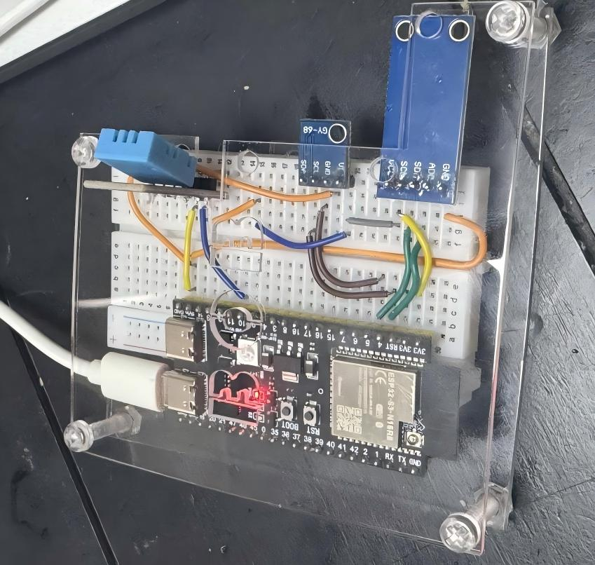
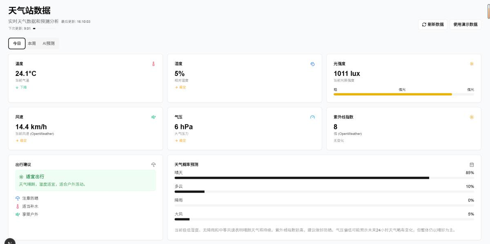

# 🌦️ ESP32 Weather AI Station

一个基于 ESP32 构建的小型智能气象站，结合 AI 实现气象预测和建议。  
该项目集成了多种传感器，通过 ThingSpeak 云平台上传数据，并使用 AI 模型生成天气预测与建议，最终通过前端展示。

---

## 📌 项目特色

- 使用 ESP32-S3-N16R8 收集环境数据（温度、湿度、气压、光照）
- 传感器：DHT11、BMP180、BH1750
- 利用 PlatformIO 进行嵌入式开发
- 传感器数据上传至 ThingSpeak 平台
- 使用 DeepSeek / OpenAI API 进行 AI 预测
- 前端展示气象数据和 AI 建议（Next.js + Express 后端）
- 后期计划独立供电 + 亚克力外壳封装

---

## 🛠️ 技术栈

| 部分 | 技术/工具 |
|------|-----------|
| 硬件 | ESP32-S3-N16R8, DHT11, BMP180, BH1750 |
| 软件开发 | PlatformIO, C++, Arduino SDK |
| 云平台 | ThingSpeak |
| AI 推理 | DeepSeek API, OpenAI |
| 后端 | Express.js |
| 前端 | Next.js + Tailwind |
| 展示 | GitHub Pages / Vercel（可选部署） |

---

## 📷 项目效果预览
```markdown



